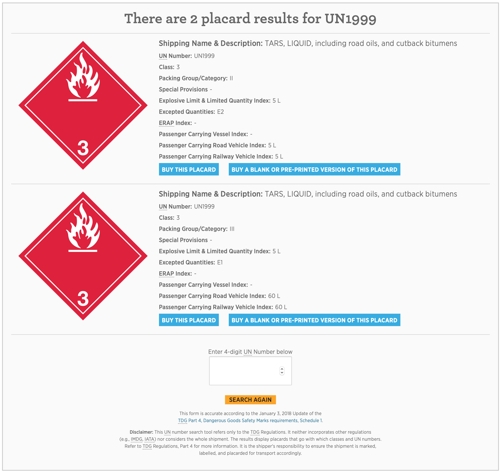

# TDG Placard Lookup - WordPress Plugin

## Description & Usage
This plugin uses [data published by Open Canada] (https://open.canada.ca/data/en/dataset/197260f1-b5dc-4f53-a036-2541cff379eb) to search for chemical classification and other related information by the chemical's UN Number.

This plugin creates a form anywhere on your website using the shortcode `[tdg_placard_lookup /]`

Originally created for http://tdgplacards.ca as a sales tool on a landing site for customers to interact with and find out what placard they need to order.

## Screenshots

**Blank form ready for input**
![Blank form ready for input] (https://raw.githubusercontent.com/ericfrisino/tdg-placard-lookup/master/screenshots/form-no-result.png?token=AC0dzBuBWUOcjJRfu5FbFyHCpSQ5F9F_ks5b2YjiwA%3D%3D)

**Form returned with no results**
![Form returned with no results]
(https://raw.githubusercontent.com/ericfrisino/tdg-placard-lookup/master/screenshots/form-no-result.png?token=AC0dzHTiHb9iQ5Ck9oAs14_RtdPnGEc4ks5b2YlewA%3D%3D)

**Form returned with one result**
![Form returned with one result]
(https://raw.githubusercontent.com/ericfrisino/tdg-placard-lookup/master/screenshots/form-one-result.png?token=AC0dzNKPOtYdyVBJAXvS7WW8fRffXiJfks5b2YkRwA%3D%3D)

**Form returned with multiple results**

## Future to-dos
- Implement automatic upgrade routine for the database when Open Canada updates their data.
- Implement deletion routine when the plugin is deleted through the plugin menu interface.
