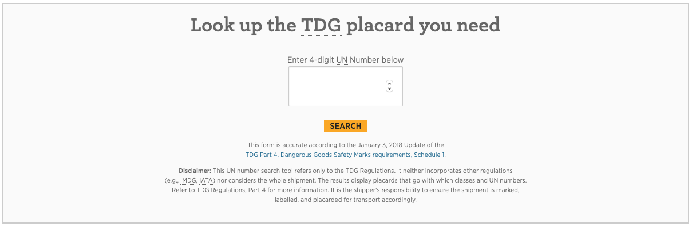
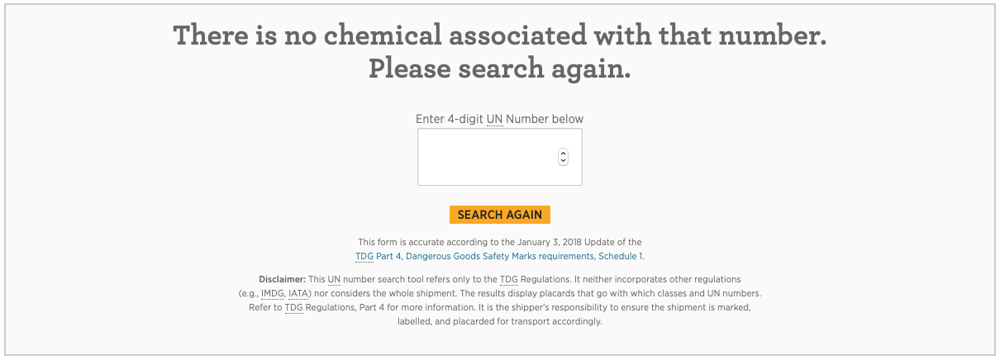
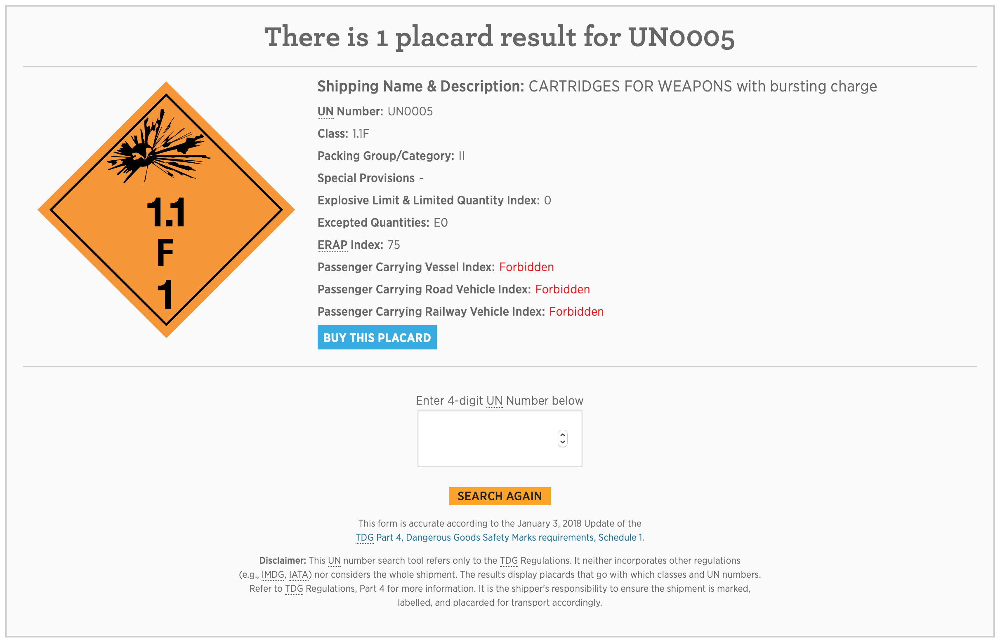

# TDG Placard Lookup - WordPress Plugin

## Description & Usage
This plugin uses [data published by Open Canada](https://open.canada.ca/data/en/dataset/197260f1-b5dc-4f53-a036-2541cff379eb) to search for chemical classification and other related information by the chemical's UN Number.

This plugin creates a form anywhere on your website using the shortcode `[tdg_placard_lookup /]`

Originally created for http://tdgplacards.ca as a sales tool on a landing site for customers to interact with and find out what placard they need to order.

For demo purposes this plugin is being integrated into a light single site version of The Compliance Center's WP network that you will be able to see on my portfolio soon.

## Screenshots

**Blank form ready for input**

**Form returned with no results**

**Form returned with one result**

**Form returned with multiple results**

## Future to-dos
- Implement automatic upgrade routine for the database when Open Canada updates their data.
- Implement deletion routine when the plugin is deleted through the plugin menu interface.
- Create a default set to styles for the form instead of using the current theme's styles.
